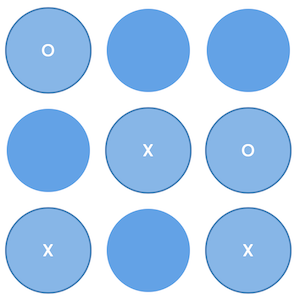
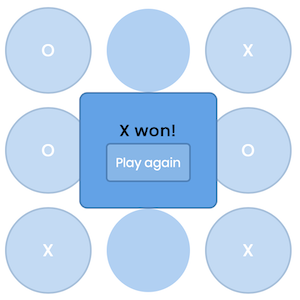

# Tic-Tac-Toe game
Developed by [Denis Voloshin](https://github.com/3a4ik)

## Description
3x3 tic-tac-toe game using [React](https://reactjs.org/) library.

## Installation
Clone project:
```bash
git clone https://github.com/3a4ik/react-tic-tac-toe.git ttt-game
cd ttt-game
```

Download dependencies and start development server:
```bash
npm install
npm run dev
```

If you want to serve development or production build of the game, run:
```bash
npm run serve:dev
npm run serve:prod
```

## Screenshots
 

## License
Software is licensed under the [MIT license](https://opensource.org/licenses/MIT), so, feel free to modificate or distribute this software, but don't forget to notice license and copyright in your project.
